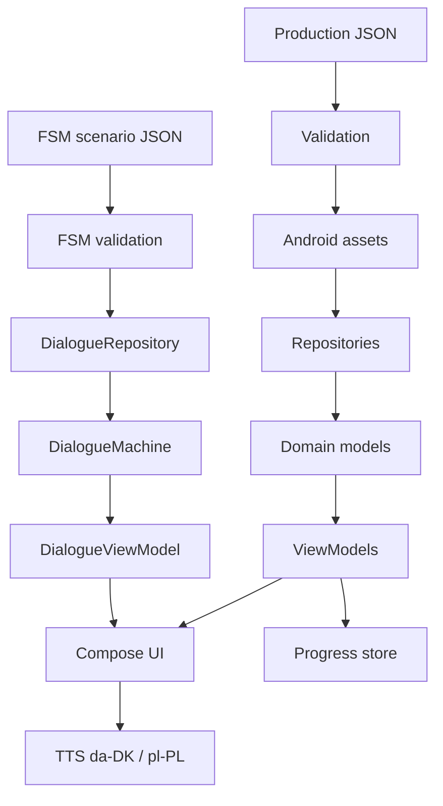

# Architecture

## Status legend

- **V1** — required for first usable implementation.
- **NICE-TO-HAVE** — explicitly deferred.
- **OPEN** — implementation decision still required.
- **LINGUISTIC REVIEW** — requires Danish/Polish language review before freezing content.

## System boundary

The app is offline-first. Course content and FSM scenarios are local assets. External resources, if added, are optional and must never be required to open lessons.



## Separation of concerns

| Layer | Responsibility | Must not do |
|---|---|---|
| Content data | Danish/Polish linguistic material | Android navigation |
| Repository | Load/validate/map assets | Render UI |
| Domain model | Stable app concepts | Know Compose widgets |
| DialogueMachine | FSM state + transitions | Navigate app screens |
| ViewModel | Screen state/actions | Contain production linguistic data |
| Compose UI | Display and input | Decide pedagogical transitions |
| TTS | Speak requested text/locale | Autoplay in V1 |
| Progress | Save normal course progress | Resume unfinished FSM in V1 |

## Suggested package structure

```text
app/src/main/java/.../
  data/
    content/
    dialogue/
    progress/
  domain/
    model/
    dialogue/
  ui/
    navigation/
    menu/
    lesson/
    dialogue/
    quiz/
    grammar/
    children/
    about/
  tts/
  validation/
```

**OPEN:** final package/application ID.

## Core architectural rule

FSM state and Android navigation state are different state machines. Do not merge them. A user can leave a dialogue screen via Android navigation; inside that screen, DialogueMachine controls only the conversational state.
