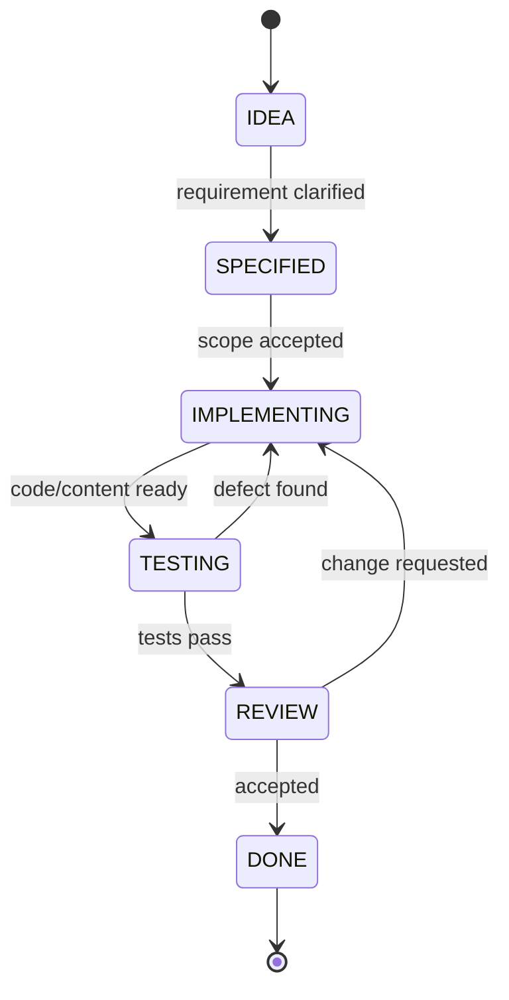

# Development Workflow

## Principle

Documentation and state models are part of implementation, not post-release paperwork.

## Change flow

## State table

| State | Required evidence | Exit |
|---|---|---|
| IDEA | problem/goal | requirement written |
| SPECIFIED | V1/NTH/OPEN status + acceptance criteria | implementation begins |
| IMPLEMENTING | code/content + local checks | ready for tests |
| TESTING | automated/manual results | pass or defect |
| REVIEW | diff/content/UX reviewed | accept/change |
| DONE | docs + tests consistent | release backlog |

## Documentation rule

Update the relevant documentation when:
- navigation changes;
- JSON contract changes;
- FSM transition rules change;
- a NICE-TO-HAVE becomes V1;
- an OPEN decision is resolved;
- course structure changes;
- a known limitation is discovered.

## Commit discipline

Prefer small commits grouped by purpose:
- docs:
- feat:
- fix:
- test:
- content:
- build:

Do not mix a large linguistic rewrite with unrelated engine refactoring if avoidable.

## Definition of Done

A feature is Done when:
1. behaviour is specified;
2. implementation matches the specification;
3. relevant tests pass;
4. documentation is updated;
5. no unresolved contradiction is hidden;
6. user-facing Danish/Polish text is reviewed at the appropriate level.
