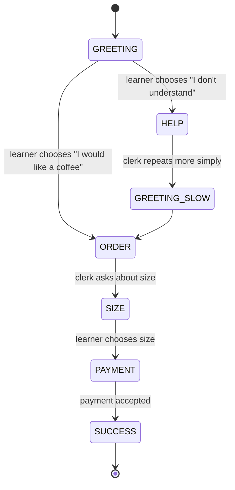

# FSM Dialogue Design

## 1. Purpose

Finite-state-machine dialogues allow a learner to take part in controlled branching conversations.

Example situation: ordering coffee in Polish.

Instead of displaying one fixed ten-line dialogue, the learner chooses a response. The selected response triggers a transition to the next dialogue state.

## 2. Conceptual state diagram



This is a documentation model. Android should load equivalent data from JSON.

## 3. Example state table

| Current state | Actor/input | Choice/condition | Next state | UI/action |
|---|---|---|---|---|
| GREETING | system/shop assistant | dialogue starts | GREETING | Show Polish greeting + optional Danish support |
| GREETING | learner | ORDER_COFFEE | ORDER | Play/offer learner phrase |
| GREETING | learner | DONT_UNDERSTAND | HELP | Move to repair branch |
| HELP | shop assistant | automatic | GREETING_SLOW | Show simpler/repeated phrase |
| GREETING_SLOW | learner | ORDER_COFFEE | ORDER | Return to main task |
| ORDER | shop assistant | automatic | SIZE | Ask size question |
| SIZE | learner | SMALL / LARGE | PAYMENT | Continue order |
| PAYMENT | learner | PAY_CARD | SUCCESS | Complete scenario |
| SUCCESS | system | terminal | — | Show completion/restart |

## 4. Proposed JSON model

```json
{
  "id": "dlg-cafe-001",
  "title": {
    "support": "På café",
    "target": "W kawiarni"
  },
  "startStateId": "GREETING",
  "states": [
    {
      "id": "GREETING",
      "speaker": "npc",
      "utterance": {
        "support": "Goddag. Hvad skulle det være?",
        "target": "Dzień dobry. Co podać?"
      },
      "choices": [
        {
          "id": "ORDER_COFFEE",
          "text": {
            "support": "Jeg vil gerne have en kaffe.",
            "target": "Poproszę kawę."
          },
          "nextStateId": "ORDER"
        },
        {
          "id": "DONT_UNDERSTAND",
          "text": {
            "support": "Jeg forstår ikke.",
            "target": "Nie rozumiem."
          },
          "nextStateId": "HELP"
        }
      ]
    },
    {
      "id": "SUCCESS",
      "terminal": true,
      "utterance": {
        "support": "Bestillingen er gennemført.",
        "target": "Zamówienie zakończone."
      }
    }
  ]
}
```

## 5. Android model proposal

Possible domain model:

```text
DialogueScenario
  id
  title
  startStateId
  states: Map<StateId, DialogueState>

DialogueState
  id
  speaker
  utterance
  choices
  terminal
  hint?
  tags?

DialogueChoice
  id
  text
  nextStateId
  feedback?
```

Runtime state:

```text
DialogueSession
  scenarioId
  currentStateId
  visitedStateIds
  selectedChoiceIds
  completed
```

## 6. Transition function

Core engine behaviour should be conceptually simple:

```text
transition(currentStateId, choiceId) -> nextStateId
```

No random behaviour is required for version 1.

The same state + same choice should always produce the same next state.

## 7. Error and repair states

FSM is especially useful for language learning because misunderstandings can be modelled explicitly.

Examples:

- learner does not understand;
- learner chooses grammatically weak wording;
- learner asks the other person to repeat;
- learner gives an unsuitable answer;
- learner returns to the main conversation after a repair sequence.

A repair branch should usually rejoin the main task instead of ending the dialogue immediately.

## 8. Correctness versus natural variation

Not every choice needs to be labelled simply “right” or “wrong”.

Suggested categories:

- `preferred`
- `acceptable`
- `repair`
- `incorrect`

**UNCERTAIN:** Whether these categories should be visible to the learner in the first version.

## 9. Weighted transitions — later extension

A future version could attach weights to variants:

```json
{
  "next": [
    {"stateId": "A", "weight": 70},
    {"stateId": "B", "weight": 30}
  ]
}
```

This could create more natural replay variation.

**UNCERTAIN / NOT FOR V1:** Weighted/random transitions complicate reproducibility, testing, progress and pedagogical explanation. Start with deterministic FSMs.

## 10. Scoring — later extension

Possible scoring dimensions:

- task completion;
- number of repair branches;
- preferred/acceptable response ratio;
- vocabulary coverage;
- grammar objective coverage.

**UNCERTAIN / NOT FOR FIRST PROTOTYPE:** Do not introduce a global numeric score until the pedagogical meaning is defined.

## 11. Persistence

Options:

A. No persistence: restarting a dialogue always starts over.

B. Save only completed/not completed.

C. Save the full current FSM state and history.

Recommended first prototype: **B**, unless implementation testing shows that resumable dialogues add clear value.

**UNCERTAIN:** Final persistence behaviour.

## 12. Relation to standard dialogues

Standard linear dialogues remain useful for:

- listening;
- reading;
- repetition;
- predictable phrase review.

FSM dialogues are better for:

- decision-making;
- conversational repair;
- practical response selection;
- replayability;
- modelling alternate conversational paths.

Both models should coexist.
