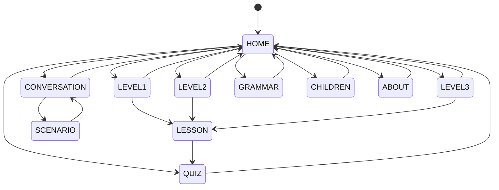

# Navigation State Model

## Purpose

Make top-level navigation explicit before UI code is written. This prevents screen-switching logic from becoming scattered across Compose callbacks.

## App navigation states

## Navigation table

| Current | Event | Guard | Next | Action |
|---|---|---|---|---|
| HOME | tap Niveau 1 | module available | LEVEL1 | show lesson list |
| HOME | tap Niveau 2 | structure exists | LEVEL2 | show available/not-yet-filled state |
| HOME | tap Niveau 3 | structure exists | LEVEL3 | show available/not-yet-filled state |
| HOME | tap Samtaletræning | module available | CONVERSATION | show scenario list |
| LEVELx | select lesson | lesson has content | LESSON | load lesson by stable ID (Phase 2) |
| LEVELx | select lesson | lesson is not released | LESSON_UNAVAILABLE | show not-yet-available screen, do not crash |
| LEVELx | select lesson | unknown id | LEVELx | stay on the level |
| LESSON | final next/quiz | quiz exists | QUIZ | open lesson quiz |
| CONVERSATION | select scenario | valid FSM | SCENARIO | initialize at startStateId |
| SCENARIO | back | always | CONVERSATION | discard unfinished V1 FSM session |
| any child screen | back/home | always | parent/HOME | standard navigation |

## Empty module rule

The complete structure is built before all content exists. Therefore empty Level 2/3 modules must not crash or expose placeholder nonsense. Show a clear not-yet-available state.

## Separate FSMs

There are at least three useful state domains:

1. App navigation FSM.
2. Lesson/quiz UI state.
3. Conversation FSM.

Keeping them separate makes tests and later changes clearer.
