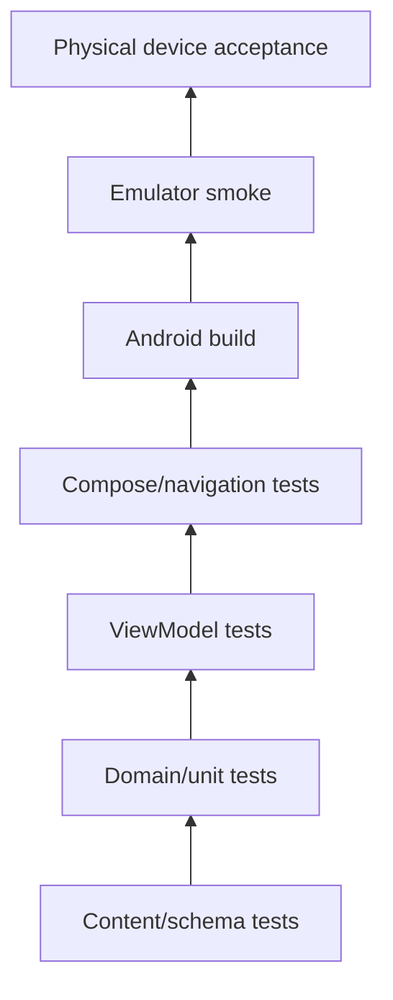

# Testing and QA Strategy

## Test pyramid

The diagram shows increasing integration, not test quantity.

## Required V1 gates

| Gate | Pass condition |
|---|---|
| Content | JSON parses; stable IDs; DA/PL fields present |
| Linguistic | released Level 1 reviewed for meaning/natural Polish |
| FSM graph | valid start, targets, terminal states, reachability |
| FSM transition | same state + same choice always gives same next state |
| TTS | Danish and Polish speak only on button press |
| Support reveal | Danish hidden initially and toggles correctly |
| Navigation | all top-level menu routes open/back safely |
| Empty modules | Level 2/3 skeleton handled without crash |
| Quiz | answers and scoring tied to stable IDs |
| Build | clean debug build succeeds |
| Device | physical Android smoke test succeeds |

## FSM graph tests

For each scenario calculate/check:
- start state exists;
- every transition target exists;
- reachable-state set;
- terminal-state set;
- dead-end non-terminal states;
- cycles.

Cycles are not automatically errors: a repair loop can be intentional. Any cycle should be documented or bounded by user choice.

## Regression rule

When a defect is found, add a test that reproduces it before/with the fix whenever practical.

## Linguistic QA

Automated validation cannot prove natural Polish. Human review remains required for:
- inflection;
- register;
- semantic equivalence;
- idiomatic phrases;
- case use;
- cultural/pragmatic appropriateness.
